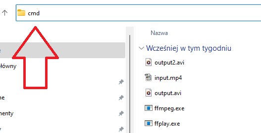
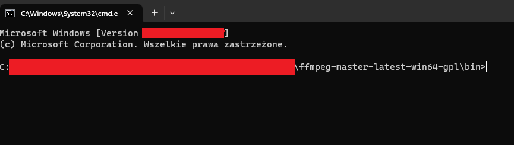
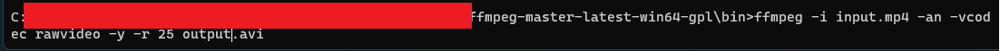
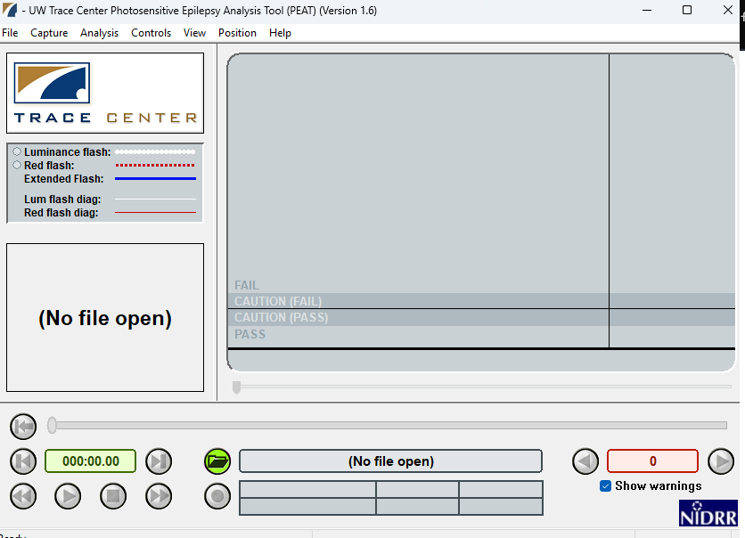
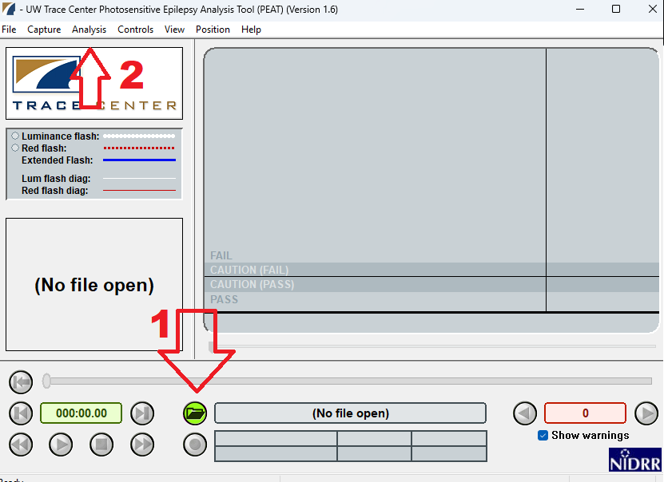
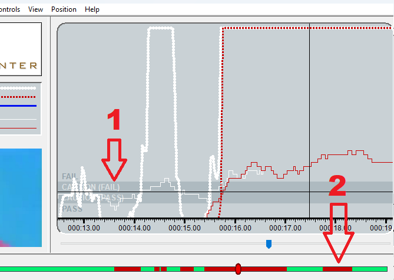

# Jak automatycznie testować video pod kątem czynników wywołujących epilepsje ekranową?

## Szybka instrukcja dla Windowsa

1. Ściągnij i zainstaluj: [Photosensitive Epilepsy Analysis Tool](https://trace.umd.edu/peat/) oraz [FFmpeg](https://ffmpeg.org/).
2. Otwórz folder z zainstalowanym FFmpeg. Uruchom wiersz poleceń (CMD) w folderze **BIN**. Wpisz:
   `ffmpeg -i input.mp4 -an -vcodec rawvideo -y -r 25 output.avi`

   - Input.mp4 to film w folderze **BIN**, który chcesz sprawdzić. Output.avi to film przekształcony do formatu niezbędnego dla programu testującego pod kątem czynników wywołujących epilepsje ekranową.

3. Otwierasz program PEAT (Photosensitive Epilepsy Analysis Tool) i otwierasz plik **input.avi**.
4. Kliksz z menu **Analysis**, a następnie **Analyze Video**. Wykres wskazuje momenty, kiedy film może wywołać atak epilepsji ekranowej.

## Pełna instrukcja dla Windowsa

### Epilepsja ekranowa

Błyski mogą wywołać napady padaczkowe. Międzynarodowe wytyczne WCAG w celu ochrony użytkowników proponują:

> Kryterium sukcesu 2.3.1 Trzy błyski lub wartości poniżej progu
> (Poziom A)
>
> Strony internetowe nie zawierają w swojej treści niczego, co błyska częściej niż trzy razy w ciągu jednej sekundy, lub też błysk nie przekracza wartości granicznych dla błysków ogólnych i czerwonych.

Źródło: [Polskie tłumaczenie WCAG 2.1](https://www.w3.org/Translations/WCAG21-pl/#trzy-b-yski-lub-wartosci-ponizej-progu).

Jednym z najgłośniejszych przypadków był film animowany "Pokemon". Jeden z odcinków zawierał błyski z kolorem czerwonym. W efekcie w 1997 r. w Japonii ponad 600 dzieci trafiło do szpitali (Źródło: Gazeta Pomorska nr 209, 8 września 2017 r.).

### Niezbędne programy

Potrzebujemy:

1. Programu do analizy materiału video (strony, animacji, wywiadu itd.).
2. Programu do konwersj formatów plików.

[Photosensitive Epilepsy Analysis Tool](https://trace.umd.edu/peat/) to program analizujący video pod kątem czynników wywołujących epilepsję ekranową. Został opracowany przez Trace Center (Uniwersytet w Maryland), a sfinansowany przez Deparatament Edukacji USA. Jest bezpłatny do stosowania dla twórców stron internetowych.

> **UWAGA** Programu nie można używać do zastosowań komercyjnych wyprodukowanych na potrzeby tv i gier.

Główne funkcje zostały opracowane w 2009 r., dlatego program ma ograniczoną obsługę: formatów plików, rozdzielczości i klatek na sekundę.

[FFmpeg](https://ffmpeg.org/) to program do konwersji formatów plików video. Tym programem przygotujemy materiał do wymagań programu do analizy.

Instalujemy oba programy i zapamiętujemy folder w którym są zainstalowane.

### Przygotowanie filmu

[Jeśli nie otrzymaliśmy filmu to możemy go nagrać za pomocą narzędzi w Windowsie](https://support.microsoft.com/pl-pl/windows/nagrywanie-ekranu-za-pomoc%C4%85-aplikacji-xbox-game-bar-przy-u%C5%BCyciu-czytnika-zawarto%C5%9Bci-ekranu-5328cd25-9046-4472-8a14-c485f138802c).

Wymagania dla materiału testowego:

- 25 lub 30 klatek na sekundę;
- nieskompresowany format AVI;
- rozdzielczość 1024 x 768 (zalecane, ale potrafi działać z większą rozdzielczością);
- plik nie większy niż 2GB (zalecane, ale potrafi działać z większymi plikami).

Wchodzimy do folderu, gdzie jest program: [FFmpeg](https://ffmpeg.org/), a następnie do folderu **BIN**. W pasku adresowym wpisujemy: `cmd`.

Otworzy się konsola:

Wprowadzamy:

`ffmpeg -i input.mp4 -an -vcodec rawvideo -y -r 25 output.avi`

- -i - wskazuje adres pliku do przekonwertowania;
- input.mp4 - to nazwa i format pliku do przekonwertowania. Wklejamy go do folderu **BIN**;
- - an - usuwa dźwięk, który zmniejszy nam plik;
- -vcodec rawvideo - zapewnia nieskompresowaną wersję;
- -y - nadpisuje video bez pytania;
- -r 25 - ustawia 25 klatek na sekundę;
- output.avi - to nazwa i format pliku jaki będzie po konwersji dostępny w folderze **BIN**.

Zatwierdzamy przyciskiem **Enter**. Powinien wygenerować się w folderze **BIN** plik z filmem w formacie AVI.

### Przetestowanie filmu

Uruchamiamy program [Photosensitive Epilepsy Analysis Tool](https://trace.umd.edu/peat/).

Otwieramy nasz film (output.avi), klikamy na folder (1). Następnie wybieramy z menu **Analysis** (2) opcję **Analyze Video**.

Na wykresie będą zaznaczone elementy, które mogą wywołać atak epilepsji ekranowej. W lewym oknie wyświetli się moment filmu, w którym jest problematyczny fragment.

Jeśli wykres przecina linie o nazwie **FAIL** (1) to występuje zagrożenie, że materiał może wywołać atak. Obszary potencjalne niebezpieczne będą na pasku video oznaczone jako czerwone (2). Na wykresie mamy do czynnienia z trzema rodzajami:

- luminacja (biała kropkowana linia);
- czewony błysk (czerwona kropkowana linia);
- przedłużony błysk (niebieska linia).
