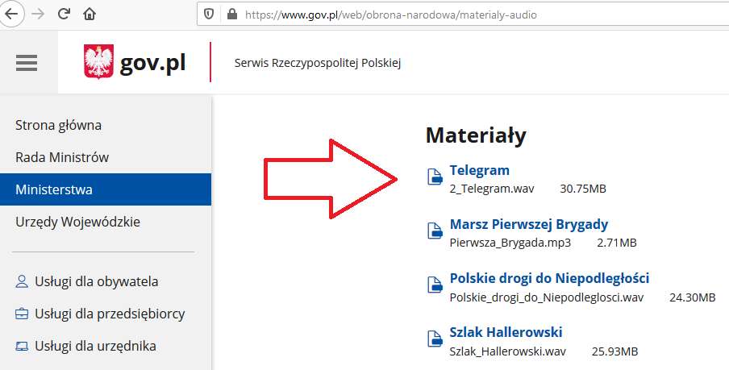

# Postrzegalność

## 1.1.1–Treść nietekstowa

Grafika powinna mieć opis, który jest dostępny dla czytnika ekranu. Taki opis umieszcza się w kodzie HTML (atrybut **alt="Opis obrazka"**). Istotne jest opisanie zawartości grafiki. W przypadku nieprawidłowego opisu będzie to uznane jako błąd. Bardzo często redaktorzy stron dodają do grafiki opis: "Zdjęcie 1", które osobie niewidomej nie jest w stanie pomóc.
Jest też wyjątek od obowiązku uzupełniania atrybutu **alt**. Jest nim grafika ozodbna. Dla poprawnej współpracy z czytnikiem ekranu artybut **alt** musi być w kodzie, ale powinien być pusty (Poprawny zapis w kodzie: **alt=""**).

Poniżej przykład weryfikacji atrybutu **alt** (wystarczy przeglądarka internetowa).

Kliknij prawym przyciskiem myszy na obrazek, a następnie wybierz "zbadaj" (opcja w Chrome, w Firefoxie opcja nazywa się "zbadaj element"). W kodzie znajdziesz linijkę **alt="Włocławek"**. To jest właśnie linijka opisująca obrazek, która jest czytana przez czytnik ekranu. Zwróć uwagę, że opis jest niepoprawny. Prawidłowo opisany obrazek informuje co znajduje się na obrazku. W tym przypadku poprawny opis to: **alt="Budynek z czerownej cegły. Na budynku są narysowane litery KZMR"**.

## 1.2.1–Tylko audio oraz tylko wideo (nagranie)

Jeśli mamy nagranie tylko audio albo tylko video powinny do niego być alternatywy:

- dla osób niesłyszących (np. transkrypcja w przypadku pliku tylko audio);
- dla osób niewidomych (np. tekst lub plik dźwiękowy w przypadku pliku tylko video).

Na stronie [Ministerstwa Obrony Narodowej](https://www.gov.pl/web/obrona-narodowa/materialy-audio) mamy materiały audio, która nie posiadają alternatywy dla osób niesłyszących.

## 1.2.2–Napisy rozszerzone (nagranie)

Wszystkie materiały multimedialne powinny posiadać napisy rozszerzone tj. dialogi i kluczowe informacje dźwiękowe (np. słychać alarm przeciwpożarowy). Jest to niezbędne dla osób niesłyszących i słabosłyszących. Pomocne będzie także dla osób z zaburzeniami poznawczymi oraz osób z uszkodzonymi głośnikami lub w głośnym miejscu (balkon nad ulicą) albo cichym (biblioteka).

Materiał Ministerstwa Środowiska pt. "Przeżyj to! Polskie parki narodowe" – Wielkopolski Park Narodowy" nie zawiera napisów rozszerzonych. Pomimo, że platforma Youtube umożliwia dodawanie napisów do filmów.

Przykład poprawnie zrealizowanych napisów rozszerzonych możemy zobaczyć w filmie Ministerstwa Inwestycji i Rozwoju. Kanał Youtube umożliwia włączenie napisów. W przypadku poruszania się czytnikiem ekranu należy tabulatorem dojść do opcji w filmie (przycisk nazywa się "napisy"). Pozostali użytkownicy mogą włączyć napisy poprzez kliknięcie pierwszej ikony w prawym dolnym rogu filmu.

## 1.2.3–Audiodeskrypcja lub alternatywa dla mediów (nagranie)

Osoba niewidoma powinna otrzymać audiodeskrypcję (dialogi + informacje o kluczowych obrazach np. awaria rzutnika, która wpływa na zachowanie na sali ). Alternatywą może być transkrypcja (dialogi + kluczowe dźwięki + kluczowe obrazy), która jest o tyle lepsza że pomoże także osobom głuchoniewidomym. **Zwróć uwagę na 1.2.5, które nakazuje obecność audiodeskrypcji**.

## 1.2.5–Audiodeskrypcja (nagranie)

Kryterium sukcesu wymagane do spełnienia dopiero w ramach Ustawy z dnia 4 kwietnia 2019 r.o dostępności cyfrowej stron internetowych i aplikacji mobilnych podmiotów publicznych. Kryterium pokrywa się z 1.2.3 i wręcz nakazuje obecność audiodeskrypcji. Jeśli mamy audiodeskrypcję w ramach kryterium 1.2.3 to automatycznie 1.2.5 jest spełnione.

## 1.3.1–Informacje i relacje

Używanie niesemantyczne tagów może utrudniać korzystanie z narzędzi asystujących np. trzymanie danych tabelarycznych w div'ach:

## 1.3.2–Zrozumiała kolejność

Za pomocą styli możemy zmienić kolejność elementów. Czytnik ekranu może innaczej odczytać tą kolejność. Powinniśmy zadbać o poprawną kolejność także w HTML (przetestować czytnikiem ekranu).

## 1.3.3–Właściwości zmysłowe

Instrukcje nie powinny opierać na właściwościach zmysłowych np. kształt, rozmiar, lokalizacja itd. Np. podawanie informacji, że coś znajduje się po lewej stronie będzie utrudnieniem dla osoby niewidomej.

## 1.3.4 –Orientacja –wyświetlanie treści w układzie poziomym, jak i pionowym (WCAG 2.1)

Niektóre osoby z niepełnosprawnościami mają na stałe przymocowane urządzenie (np. tablet, telefon) w określonej orientacji (np. poziomo). Strona nie powinna blokować dostosowania się do innej orientacji (są wyjątki opisane w dokumentacji, ale dotyczą np. czeków albo grania na pianinie).

## 1.3.5 –Określenie prawidłowej wartości (WCAG 2.1)

Osoby z zaburzeniami poznawczymi oraz osoby z trudnościami ruchowymi wymagają więcej czasu, aby uzupełnić formularz. Jest to często powtarzalna czynność, którą mogą zautomatyzować narzędzia asystujące lub przeglądarka. Pola formularza powinny mieć określony typ spodziewanej danej (np. e-mail) oraz atrybut autocomplete np.:

<input type=”text” autocomplete=”street-address”>

[W3C opublikował listę wartości dla tego atrybutu](https://www.w3.org/TR/WCAG21/#input-purposes).
[Przydatne link dotyczący 1.3.5](https://knowbility.org/blog/2018/WCAG21-135InputPurpose/)

## 1.4.1–Użycie koloru

Nie powinno przekazywać się informacji w oparciu tylko o kolor.

## 1.4.2–Kontrola odtwarzania dźwięku

Jeśli cokolwiek na stronie odtwarza się dłużej niż 3 sekundy to powinien być mechanizm umożliwiający przerwanie, lub wyłączenie lub zmianę poziomu głośności. Takie elementy mogą zagłuszać czytnik ekranu.

## 1.4.3–Kontrast (minimalny)

Strona powinna mieć odpowiednie proporcje kontrastu (4,5:1). [Można to sprawdzić za pomocą narzędzia](https://webaim.org/resources/contrastchecker/).

## 1.4.4–Zmiana rozmiaru tekstu

Strona powinna dać się powiększyć bez utraty treści lub funkcjonalności.

## 1.4.5–Tekst w postaci grafiki

Obrazek z tekstem, który nie posiada także opisu (uzupełnionego alta) to błąd. Użytkownik korzystający z czytnika ekranu nie będzie miał informacji, że są tu informacje.

## 1.4.10 –Zawijanie tekstu (WCAG 2.1)

Strona powinna być responsywna, aby nie pojawiał się suwak przewijania na rozdzielczości 320. Jest to pomocne dla osób słabowidzących (np. przy powiększaniu ekranu o 400%, kiedy viewport ma ustawione 1280 szerokości). Są wyjątki od tego wymogu jak np. tabele, mapy, gry, prezentacje.
[Więcej o kryterium sukcesu 1.4.10](https://knowbility.org/blog/2018/WCAG21-1410Reflow/).

## 1.4.11 – Kontrast dla treści niebędących tekstem (WCAG 2.1)

Treści niebędących tekstem też powinny mieć odpowiedni kontrast (proporcja 3:1).

## 1.4.12 – Odstępy w tekście (WCAG 2.1)

Użytkownicy mający problem z czytaniem (np. słabowidzący albo dyslektycy) powinni móc zmienić ustawienia bez utraty treści lub funkcjonalności. Użytkownicy mogą zmieniać:

- wysokość linii (odstępy między wierszami) co najmniej 1,5 razy większa niż wielkość czcionki;
- odstępy po akapitach co najmniej 2-krotnie większe niż rozmiar czcionki;
- odstępy między literami (śledzenie) co najmniej 0,12 razy większa niż wielkość czcionki;
- odstępy między wyrazami co najmniej 0,16 wielkości czcionki.

Błąd często jest powodowany ustawianiem stałej szerokości kontenerów.

## 1.4.13 – Treści spod kursora lub fokusa (WCAG 2.1)

Często na stronie jest wyzwalana dodatkowa treść po najechaniu myszą lub wejściu fokusem na element. Powinna ona spełniać następujące warunki:

- nowa treść jest możliwa do ukrycia bez przesuwania wskaźnika myszy lub fokusa (chyba, że dotyczy wyświetlenia błędu albo nie zakłóca dotychczasowej treści strony). Takim ukryciem może być wciśnięcie przycisku Escape.
- przesunięcie wskaźnika myszy lub fokusa nie powoduje zniknięcie nowej treści;
- treść powinna zostać do czasu, aż wskaźnik myszy lub fokus nie wyjdzie z elementu wyzwalającego nową treść lub nowa treść nie zostanie zamknięta lub nie będzie już aktualna.

Osoby z trudnościami motorycznymi mogą mieć problem z utrzymaniem myszy nad danym elementem. Osoby słabowidzące mogą mieć problem podczas korzystania z technologii asystujących, ponieważ dodatkowa treść może nieprawidłowo działać przy powiększeniu strony. Osoby z zaburzeniami poznawczymi wymagają dłuższego czasu do zapoznania się z treścią.

## [Wróć do spisu treści](../README.md)
