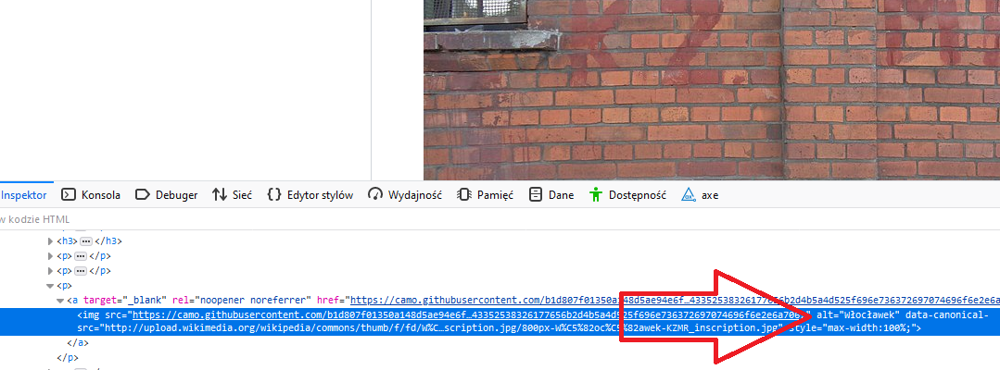

# Wytyczne WCAG

## Co to jest WCAG?

Międzynarodowe wytyczne WCAG (Web Content Accessibility Guidelines) są opracowywane przez [grupę W3C](https://www.w3.org/WAI/). Jest to zbiór zasad, które poprawiają dostępność stron dla osób z niepełnosprawnościami. Wytyczne są wykorzystywane w aktach prawnych w wielu krajach.

Mamy różne wersje wytycznych:

- WCAG 1.0 (opublikowany w 1999 r.);
- WCAG 2.0 (opublikowany w 2008 r. - obecnie dominujący w wielu krajach, [polskie tłumaczenie WCAG 2.0](http://fdc.org.pl/wcag2/));
- WCAG 2.1 (opublikowany w 2018 r. - po okresie przejściowy będzie to wymagany standard w Polsce. Więcej w dziale [Wymogi prawne](./5_Wymogi_prawne.md)).

Wytyczne dzielą się na kryteria sukcesu (WCAG 2.0 - 61, WCAG 2.1 - 78). Każde z kryterium ma przypisany poziom (A, AA, AAA). Spełnienie wszystkich wytycznych nie zawsze da pełną dostępność (WCAG zawiera takie zastrzeżenie), dlatego warto testować z użytkownikami z niepełnosprawnościami. Dodatkowo wytyczne mówią, że spełnienie wytycznych na najwyższym poziomie AAA nie zawsze jest możliwe.

Oprócz wytycznych są dodatkowe dokumenty (liczne strony w języku angielskim) np.:

- [„How to Meet WCAG 2.1” — lista kontrolna](https://www.w3.org/WAI/WCAG21/quickref/);
- [„Understanding WCAG 2.1” — bardziej szczegółowy opis WCAG pozwalający zrozumieć istotę problemów](https://www.w3.org/WAI/WCAG21/Understanding/);
- [„Techniques for WCAG 2.1” — wskazówki dla programistów i projektantów](https://www.w3.org/WAI/WCAG21/Techniques/);
- [„The WCAG Documents” — powiązania dokumentów WCAG](https://www.w3.org/WAI/standards-guidelines/wcag/docs/).

  Przykładowe kryterium sukcesu:
  „2.3.1 Trzy błyski lub wartości poniżej progu: Strony internetowe nie zawierają w swojej treści niczego, co migocze częściej niż trzy razy w ciągu jednej sekundy, lub też błysk nie przekracza wartości granicznych dla błysków ogólnych i czerwonych”.

  Błyski mogą wywołać atak padaczki!

## Przykładowe błędy WCAG 2.1

**Sekcja zawiera przykładowe błędy tylko tych kryteriów sukcesu, które są wymagane przez polskie prawo**. W danym kryterium sukcesu można popełnić różne błędy, ale przykłady jest ograniczony zazwyczaj do jednego typu błędu.

### 1.1.1–Treść nietekstowa

Grafika powinna mieć opis, który jest dostępny dla czytnika ekranu. Taki opis umieszcza się w kodzie HTML (atrybut **alt="Opis obrazka"**). Istotne jest opisanie zawartości grafiki. W przypadku nieprawidłowego opisu będzie to uznane jako błąd. Bardzo często redaktorzy stron dodają do grafiki opis: "Zdjęcie 1", które osobie niewidomej nie jest w stanie pomóc.
Jest też wyjątek od obowiązku uzupełniania atrybutu **alt**. Jest nim grafika ozodbna. Dla poprawnej współpracy z czytnikiem ekranu artybut **alt** musi być w kodzie, ale powinien być pusty (Poprawny zapis w kodzie: **alt=""**).

Poniżej przykład weryfikacji atrybutu **alt** (wystarczy przeglądarka internetowa).

Kliknij prawym przyciskiem myszy na obrazek, a następnie wybierz "zbadaj" (opcja w Chrome, w Firefoxie opcja nazywa się "zbadaj element"). W kodzie znajdziesz linijkę **alt="Włocławek"**. To jest właśnie linijka opisująca obrazek, która jest czytana przez czytnik ekranu. Zwróć uwagę, że opis jest niepoprawny. Prawidłowo opisany obrazek informuje co znajduje się na obrazku. W tym przypadku poprawny opis to: **alt="Budynek z czerownej cegły. Na budynku są narysowane litery KZMR"**.

### 1.2.1–Tylko audio oraz tylko wideo (nagranie)

Jeśli mamy nagranie tylko audio albo tylko video powinny do niego być alternatywy:

- dla osób niesłyszących (np. transkrypcja w przypadku pliku tylko audio);
- dla osób niewidomych (np. tekst lub plik dźwiękowy w przypadku pliku tylko video).

### 1.2.2–Napisy rozszerzone (nagranie)

Wszystkie materiały multimedialne powinny posiadać napisy rozszerzone tj. dialogi i kluczowe informacje dźwiękowe (np. słychać alarm przeciwpożarowy). Jest to niezbędne dla osób niesłyszących i słabosłyszących. Pomocne będzie także dla osób z zaburzeniami poznawczymi oraz osób z uszkodzonymi głośnikami lub w głośnym miejscu (balkon nad ulicą) albo cichym (biblioteka).

### 1.2.3–Audiodeskrypcja lub alternatywa dla mediów (nagranie)

Osoba niewidoma powinna otrzymać audiodeskrypcję (dialogi + informacje o kluczowych obrazach np. awaria rzutnika, która wpływa na zachowanie na sali ). Alternatywą może być transkrypcja (dialogi + kluczowe dźwięki + kluczowe obrazy), która jest o tyle lepsza że pomoże także osobom głuchoniewidomym. **Zwróć uwagę na 1.2.5, które nakazuje obecność audiodeskrypcji**.

### 1.2.5–Audiodeskrypcja (nagranie)

Kryterium sukcesu wymagane do spełnienia dopiero w ramach Ustawy z dnia 4 kwietnia 2019 r.o dostępności cyfrowej stron internetowych i aplikacji mobilnych podmiotów publicznych. Kryterium pokrywa się z 1.2.3 i wręcz nakazuje obecność audiodeskrypcji. Jeśli mamy audiodeskrypcję w ramach kryterium 1.2.3 to automatycznie 1.2.5 jest spełnione.

### 1.3.1–Informacje i relacje

Używanie niesemantyczne tagów może utrudniać korzystanie z narzędzi asystujących np. trzymanie danych tabelarycznych w div'ach:

### 1.3.2–Zrozumiała kolejność

Za pomocą styli możemy zmienić kolejność elementów. Czytnik ekranu może innaczej odczytać tą kolejność. Powinniśmy zadbać o poprawną kolejność także w HTML (przetestować czytnikiem ekranu).

### 1.3.3–Właściwości zmysłowe

Instrukcje nie powinny opierać na właściwościach zmysłowych np. kształt, rozmiar, lokalizacja itd. Np. podawanie informacji, że coś znajduje się po lewej stronie będzie utrudnieniem dla osoby niewidomej.

### 1.3.4 –Orientacja –wyświetlanie treści w układzie poziomym, jak i pionowym (WCAG 2.1)

Niektóre osoby z niepełnosprawnościami mają na stałe przymocowane urządzenie (np. tablet, telefon) w określonej orientacji (np. poziomo). Strona nie powinna blokować dostosowania się do innej orientacji (są wyjątki opisane w dokumentacji, ale dotyczą np. czeków albo grania na pianinie).

### 1.3.5 –Określenie prawidłowej wartości (WCAG 2.1)

Osoby z zaburzeniami poznawczymi oraz osoby z trudnościami ruchowymi wymagają więcej czasu, aby uzupełnić formularz. Jest to często powtarzalna czynność, którą mogą zautomatyzować narzędzia asystujące lub przeglądarka. Pola formularza powinny mieć określony typ spodziewanej danej (np. e-mail) oraz atrybut autocomplete np.:

<input type=”text” autocomplete=”street-address”>

[W3C opublikował listę wartości dla tego atrybutu](https://www.w3.org/TR/WCAG21/#input-purposes).
[Przydatne link dotyczący 1.3.5](https://knowbility.org/blog/2018/WCAG21-135InputPurpose/)

### 1.4.1–Użycie koloru

Nie powinno przekazywać się informacji w oparciu tylko o kolor.

### 1.4.2–Kontrola odtwarzania dźwięku

Jeśli cokolwiek na stronie odtwarza się dłużej niż 3 sekundy to powinien być mechanizm umożliwiający przerwanie, lub wyłączenie lub zmianę poziomu głośności. Takie elementy mogą zagłuszać czytnik ekranu.

### 1.4.3–Kontrast (minimalny)

Strona powinna mieć odpowiednie proporcje kontrastu (4,5:1). [Można to sprawdzić za pomocą narzędzia](https://webaim.org/resources/contrastchecker/).

### 1.4.4–Zmiana rozmiaru tekstu

Strona powinna dać się powiększyć bez utraty treści lub funkcjonalności.

### 1.4.5–Tekst w postaci grafiki

Obrazek z tekstem, który nie posiada także opisu (uzupełnionego alta) to błąd. Użytkownik korzystający z czytnika ekranu nie będzie miał informacji, że są tu informacje.

### 1.4.10 –Zawijanie tekstu (WCAG 2.1)

Strona powinna być responsywna, aby nie pojawiał się suwak przewijania na rozdzielczości 320. Jest to pomocne dla osób słabowidzących (np. przy powiększaniu ekranu o 400%, kiedy viewport ma ustawione 1280 szerokości). Są wyjątki od tego wymogu jak np. tabele, mapy, gry, prezentacje.
[Więcej o kryterium sukcesu 1.4.10](https://knowbility.org/blog/2018/WCAG21-1410Reflow/).

### 1.4.11 – Kontrast dla treści niebędących tekstem (WCAG 2.1)

Treści niebędących tekstem też powinny mieć odpowiedni kontrast (proporcja 3:1).

### 1.4.12 – Odstępy w tekście (WCAG 2.1)

Użytkownicy mający problem z czytaniem (np. słabowidzący albo dyslektycy) powinni móc zmienić ustawienia bez utraty treści lub funkcjonalności. Użytkownicy mogą zmieniać:

- wysokość linii (odstępy między wierszami) co najmniej 1,5 razy większa niż wielkość czcionki;
- odstępy po akapitach co najmniej 2-krotnie większe niż rozmiar czcionki;
- odstępy między literami (śledzenie) co najmniej 0,12 razy większa niż wielkość czcionki;
- odstępy między wyrazami co najmniej 0,16 wielkości czcionki.

Błąd często jest powodowany ustawianiem stałej szerokości kontenerów.

### 1.4.13 – Treści spod kursora lub fokusa (WCAG 2.1)

Często na stronie jest wyzwalana dodatkowa treść po najechaniu myszą lub wejściu fokusem na element. Powinna ona spełniać następujące warunki:

- nowa treść jest możliwa do ukrycia bez przesuwania wskaźnika myszy lub fokusa (chyba, że dotyczy wyświetlenia błędu albo nie zakłóca dotychczasowej treści strony). Takim ukryciem może być wciśnięcie przycisku Escape.
- przesunięcie wskaźnika myszy lub fokusa nie powoduje zniknięcie nowej treści;
- treść powinna zostać do czasu, aż wskaźnik myszy lub fokus nie wyjdzie z elementu wyzwalającego nową treść lub nowa treść nie zostanie zamknięta lub nie będzie już aktualna.

Osoby z trudnościami motorycznymi mogą mieć problem z utrzymaniem myszy nad danym elementem. Osoby słabowidzące mogą mieć problem podczas korzystania z technologii asystujących, ponieważ dodatkowa treść może nieprawidłowo działać przy powiększeniu strony. Osoby z zaburzeniami poznawczymi wymagają dłuższego czasu do zapoznania się z treścią.

[Więcej w artykule o kryterium 1.4.13](https://knowbility.org/blog/2018/WCAG21-1413ContentHoverFocus/).

### 2.1.1 – Klawiatura

Każdy element powinien być dostępny z poziomu klawiatury. Docenią to szczególnie osoby niewidome i osoby z uszkodzonymi kończynami górnymi.

### 2.1.2 – Brak pułapki na klawiaturę

Użytkownik nie powinien być zmuszony użyć myszki, aby wyjść z danego elementu strony.

### 2.1.4 – Jednoliterowe skróty klawiszowe (WCAG 2.1)

Jeżeli udostępniamy skróty na klawiaturze to użytkownik powinien mieć możliwość wyłączenia lub zmiany klawiszy albo powinien być aktywowany jak jest na nim fokus. Jest to ważne dla osób korzystających z technologii asystujących, którzy mogą mieć problem z poruszaniem się po stronie.

### 2.2.1 – Możliwość dostosowania czasu

Jeżeli treść jest dostępna przez określony czas to użytkownik powinien mieć możliwość wyłączenia limitu czasowego lub dostosowanie go albo wydłużenie (po otrzymaniu ostrzeżenia o kończącym się czasie). Jest to szczególnie ważne dla osób niewidomych i z zaburzeniami poznawczymi.

### 2.2.2 – Wstrzymywanie (pauza), zatrzymywanie, ukrywanie

Użytkownik musi mieć opcję zatrzymania lub ukrycia informacji, która przesuwa się, porusza, migota lub automatycznie jest aktualizowana. Jest to szczególnie ważne dla osób słabowidzących i z zaburzeniami poznawczymi.

### 2.3.1 – Trzy błyski lub wartości poniżej progu

Strona nie powinna zawierać nic co migocze częściej niż trzy razy w ciągu sekundy. Może to spowodować atak padaczki. Takim najgłośniejszym przypadkiem wywołania ataku był jeden z odcinków serialu animowanego Pokemon.

### 2.4.1 – Możliwość pominięcia bloków

Strona internetowa powinna mieć mechanizm umożliwiający pomijanie bloków treści, np. poprzez dobrze zrealizowane nagłówki lub [skip linki](http://internet-bez-barier.com/skip-linki-czym-sa-i-do-czego-sluza/).

### 2.4.2 – Tytuły stron

Strona internetowa powinna posiadać tytuł, który opisuje cel i temat strony.

### 2.4.3 – Kolejność fokusu

Strona internetowa powinna "łapać" fokus w logicznej kolejności. Jeśli mamy rozdziały to naturalne jest, że fokus powinien skakać w kolejności w jakiej są rozdziały.

### 2.4.4 – Cel linku (w kontekście)

Cel linku powinien wynikać z samego linku. Bardzo często mamy liczne linki o nazwie "więcej". Użytkownik niewidomy nie jest w stanie zrozumieć dokąd prowadzi link. Link taki powinien mieć dodatkowy tekst o celu (np. ukryty za pomocą CSS-ów).

### 2.4.5 – Wiele sposobów na zlokalizowanie strony

Powinny być przynajmniej dwa sposoby zlokalizowania danej strony w serwisie np.: poprzez menu i wyszukiwarkę albo poprzez menu i mapę strony.

### 2.4.6 – Nagłówki i etykiety

Strona powinna mieć nagłówki i etykiety, które opisują temat lub cel treści.

### 2.4.7 – Widoczny fokus

Osoby poruszające się wyłącznie za pomocą klawiatury wymagają zawsze widocznego fokusa.

### 2.5.1 – Gesty punktowe (WCAG 2.1)

Strona powinna umożliwiać obsługę funkcjonalności za pomocą jednego palca (np. mapy przy powiększaniu wymagają dwóch palców, ale jest alternatywa w postaci przycisku).

### 2.5.2 – Anulowanie kliknięcia (WCAG 2.1)

Użytkownik przypadkowo może kliknąć przycisk (zwłaszcza z brakiem pełnej sprawności ruchowej), dlatego powinna istnieć możliwość anulowania danej czynności. Jeżeli mamy aplikacje do połączeń i użytkownik kliknie na "zakończ połączenie" to w przypadku automatycznego zakończenia będzie to uznane za błąd. Obejściem jest możliwość zsunięcia palca z naciskanego przycisku "zakończ połączenie" i w ten sposób anulowanie kliknięcia.

### 2.5.3 – Etykieta w nazwie (WCAG 2.1)

Od strony programistycznej też należy nawiązywać do widocznej nazwy przycisku.

[Więcej o kryterium 2.5.3 (strona w języku angielskim)](https://knowbility.org/blog/2018/WCAG21-253LabelInName/)

### 2.5.4 –Aktywowanie ruchem (WCAG 2.1)

Czynności wymagające ruchu (np. w telefonie przechylenie) mają swoją alternatywę w postaci interfejsu użytkownika.

### 3.1.1–Język strony

Strona powinna mieć zadeklarowany język, aby czytnik ekranu mógł się przełączyć na właściwy tryb odczytywania treści.

### 3.1.2–Język części

Elementy strony w języku obcym powinny również być oznaczone odpowiednim językiem (np. lang="en"), aby czytnik mógł się przełączyć na właściwy tryb odczytywania treści.

### 3.2.1–Po oznaczeniu fokusem

Oznaczenie fokusem nie powinno zmieniać kontekst (np. wysyłać formularz, przeładowywać stronę, otwierać nowe okno, zmieniać komponent).

### 3.2.2–Podczas wprowadzania danych

W trakcie wprowadzania danych nie powinien zmieniać się kontekst (np. wysyłać formularz po wprowadzeniu pełnego kodu pocztowego).

### 3.2.3–Konsekwentna nawigacja

Ważne jest, żeby nawigacja była konsekwentna tzn. nie powinniśmy zmieniać układu nawigacji w zależności od strony.

### 3.2.4–Konsekwentna identyfikacja

Ważne jest, żeby te same komponenty (opcje) były konsekwentnie nazywane.

### 3.3.1–Identyfikacja błędu

Po wykryciu błędu należy wskazać błędny element i wyświetlić opis.

### 3.3.2–Etykiety lub instrukcje

Jeżeli jest wymagany określony format wprowadzenia danych powinien być wyświetlona podpowiedź.

### 3.3.3–Sugestie korekty błędów

Jeżeli wykryliśmy błąd podczas wprowadzania danych i wiemy jak to poprawić to powinniśmy dać informację zwrotną do użytkownika.

### 3.3.4–Zapobieganie błędom (kontekst prawny, finansowy, związany z podawaniem danych)

Na stronach, gdzie jest:

- możliwość zaciągania zobowiązań prawnych lub transakcji finansowych;
- modyfikacja danych;
- zadania testowe;
  użytkownik powinien móc przynajmniej mieć jedną z możliwości:
- wprowadzane dane są odwracalne;
- dane są sprawdzane pod kątem błędów i użytkownik może wprowadzić poprawki;
- użytkownik może potwierdzić wprowadzone dane oraz dokonać ich korekty przed wysłaniem.

### 4.1.1–Parsowanie

Strona powinna przechodzić przez [walidator WC3](https://validator.w3.org/).

### 4.1.2–Nazwa, rola, wartość

Tworząc własne komponenty musimy zapewnić, aby były one dostępne dla technologii asystujących. W przypadku korzystania z HTML zgodnie z jego semantyką nie powinno być problemu.

### 4.1.3 –Komunikaty o stanie (WCAG 2.1)

Powinno się informować technologie asystujące (np. czytnik ekranu) o zmianie stanu np. rezerwując salę trzeba kliknąć przycisk. Wizualnie może być to oznaczone, ale czytnik ekranu powinien również dostawać informację, że sale zarezerwowano (wykorzystanie ARIA).

## [Wróć do spisu treści](../README.md)
