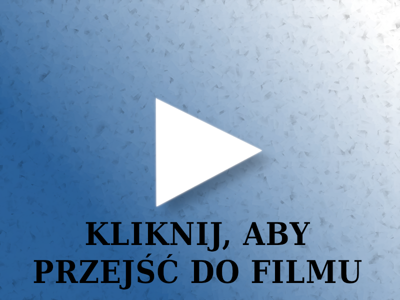

# Wskazówki dla testera

## Rozwiązania techniczne, z których korzystają osoby z niepełnosprawnościami

Programy dla osób z niepełnosprawnościami często były bardzo drogimi narzędziami. Monopol powoli przełamują darmowe alternatywy.

### Osoby niewidome

Osoby niewidome korzystają z klawiatury i czytników ekranu. Najpopularniejsze są **NVDA** (bezpłatny), **Jaws** (płatny), **Window-Eyes** (płatny).
W przypadku urządzeń mobilnych mają do dyspozycji wbudowane czytniki ekranu: **TalkBack** (Android) i **VoiceOver** (IOS).

Do konwersji skanu na tekst są używane **programy OCR**, ale nie zawsze dobrze przeprowadzają taką konwersję. Umieszczanie skanów jest uznane za poważny błąd dostępności.

### Osoby głuchoniewidome i niewidome

Osoby głuchoniewidome i niewidome wykorzystują ekrany brajlowskie (tzw. linijka brajlowska), które tekst zamieniają na znaki w [alfabecie Braille’a](https://pl.wikipedia.org/wiki/Alfabet_Braille’a) (warto zobaczyć także [polskie znaki w alfabecie Braille'a](https://pl.wikipedia.org/wiki/Polski_alfabet_Braille’a)).

Informację przy użyciu tego alfabetu zamieszcza się na lekach ([zalecania związane z użyciem alfabetu](http://pzn.org.pl/stanowisko-polskiego-zwiazku-niewidomych-w-sprawie-napisow-w-brajlu-na-opakowaniach-lekow/)).

Ekran brajlowski (Fotografia z Wikipedii):

### Osoby słabowidzące

Osoby słabowidzące wykorzystują programy powiększające (np. **Lunar** albo **ZoomText** itd.) i powiększająco-udźwiękowające (np. **Supernova**) . Warto zaznaczyć, że programy powiększające często mają możliwość powiększenia 40-krotnego (są osoby wymagające bardzo dużego powiększenia tekstu). System Windows ma program do powiększania (**[Lupa](https://support.microsoft.com/pl-pl/help/11542/windows-use-magnifier-to-make-things-easier-to-see)** oraz czytnik ekranu (**[Narrator](https://support.microsoft.com/pl-pl/help/4028598/windows-10-start-or-stop-narrator)**).

Istnieją również specjalne klawiatury dla osób słabowidzących (zdjęcie z Wikimedii):

Osoby z uszkodzeniami narządu wzroku (np. zaćma ) mogą używać [trybu wysokiego kontrastu w systemie Windows](https://support.microsoft.com/pl-pl/help/4026951/windows-10-turn-high-contrast-mode-on-or-off).

### Osoby sparaliżowane

Osoby częściowo sparaliżowane mogą korzystać z programów imitujących działanie myszy np. **Head Mouse**, który śledzi kropkę na czole i reaguje na zachowanie (np. dłuższe zatrzymanie wzroku powoduje kliknięcie).

Technologia dla osób z niepełnosprawnościami cały czas się rozwija. Osoby sparaliżowane dotychczas mogły się komunikować za pomocą narzędzi obserwujących ruchy gałki ocznej. A są opracowywane nowsze rozwiązania np.: urządzenie do komunikacji mózg-komputer.

## Tryb wysokiego kontrastu w systemie Windows

Osoby z niektórymi schorzeniami wzroku wymagają wysokiego kontrastu. Potrzebują go od uruchomienia systemu, więc nie korzystają z kontrolek przełączania kontrastu na stronach internetowych.
Windows posiada "tryb wysokiego kontrastu", a można go uruchomić klikając jednocześnie **Alt**  +  **lewy Shift**  +  **Print Screen** (w ten sam sposób się go wyłącza).

Internet Explorer i Firefox obsługują poprawnie ten tryb. W przypadku Firefoxa czasem trzeba zrestartować przeglądarkę i spr. czy jest zaznaczona odpowiednia opcja (wchodzimy w **Opcje** następnie **Kolory** ( **Język i wygląd**, następnie zaznaczamy **Kolory Systemowe**).

Chrome i Opera ignorują tryb. Należy zainstalować dodatki:

- [dodatek do poprawy kontrastu w Chrome](https://chrome.google.com/webstore/detail/high-contrast/djcfdncoelnlbldjfhinnjlhdjlikmph);
- [dodatek do poprawy kontrastu w Opera](https://addons.opera.com/pl/extensions/details/dark-mode/).

## Testowanie czytnikiem ekranu NVDA

NVDA ma możliwość podglądu mowy. Klikamy prawym przyciskiem na ikonkę NVDA w pasku systemowym, a następnie **Narzędzia** i **Podgląd mowy**.
Osoba niewidoma porusza się za pomocą klawiatury. Przydatne skróty:

- **Tabulator** - przechodzimy po wszystkich linkach i polach formularza;
- **Shift** + **Tabulator** - cofnij się do poprzedniego linka/pola formularza;
- **Insert** i **strzałka w dół** - czytaj wszystko poniżej miejsca, w którym znajduję się fokus;
- **Shift** - zatrzymaj czytanie;
- **litera H** - czytaj nagłówek;
- **Shift** + **litera H** - czytaj poprzedni nagłówek.

## [Wróć do spisu treści](../README.md)
